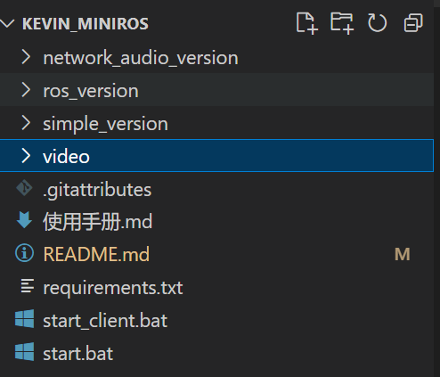

[TOC]

## 工业网络基础实验报告：基于Socket编程的远程桌面控制系统-朱文凯-2235054329

最终实验演示视频可以看：[最终演示视频]

<video src="./video/%E6%89%8B%E6%9C%BA%E6%8B%8D%E6%91%84%E8%A7%86%E9%A2%91.mp4"></video>

**实验名称：** 基于Socket编程的远程桌面控制系统

**实验目的：**

1.  掌握Python Socket编程的基本原理和应用。
2.  理解TCP/IP协议栈在数据可靠传输中的作用。
3.  理解UDP协议在低延迟数据传输中的应用。
4.  实践屏幕图像数据、控制指令以及音频数据在网络中的传输。
5.  逐步构建一个功能完善的远程桌面控制系统，体验不同网络协议和设计模式的选择与权衡。

**实验环境：**
*   操作系统：Windows (或Linux/macOS，部分代码可能需要微调)
*   编程语言：Python 3.6+
*   主要库：
    *   `socket`: 网络通信基础
    *   `opencv-python`: 图像处理和编码
    *   `numpy`: 高效的数值计算
    *   `pyautogui`: 屏幕捕获和鼠标键盘控制
    *   `pyaudio`: 音频捕获和播放 (用于 `network_audio_version`)
    *   `threading`: 实现并发处理
    *   `tkinter` (或其它GUI库): 构建客户端界面
    *   `struct`:处理C结构体格式的数据 (用于打包消息长度)
    *   `json`: 用于序列化控制命令

**实验原理概述：**

本系列实验通过Socket编程接口，利用TCP (Transmission Control Protocol) 和 UDP (User Datagram Protocol) 协议实现一个远程桌面控制系统。
*   **TCP协议**：提供面向连接的、可靠的字节流服务。适用于对数据完整性要求较高的场景，如屏幕图像的传输和音频流的传输。
*   **UDP协议**：提供无连接的、不可靠的数据报服务。适用于对实时性要求较高、能容忍少量丢包的场景，如鼠标键盘控制指令的传输。

实验将通过三个逐步完善的版本来展示系统构建过程：
1.  `simple_version`：基础的屏幕共享和鼠标控制，主要使用TCP进行屏幕数据传输，UDP进行控制指令传输。
2.  `ros_version`：在 `simple_version` 的基础上，引入类似ROS (Robot Operating System) 的节点化设计思想，将屏幕捕获和远程查看功能模块化。
3.  `network_audio_version`：在前两个版本的基础上通过在局域网下实现tcp/ip和udp实验，集成双向音频通话功能，进一步提升远程协作能力。



---

### 实验一：基于TCP/IP和UDP的简单远程桌面 (simple_version)

#### 1.1 实验目的
*   实现基于TCP的可靠屏幕图像数据传输。
*   实现基于UDP的低延迟鼠标控制指令传输。
*   构建一个基础的客户端-服务器架构的远程桌面应用。
*   熟悉图像的捕获、压缩、序列化、网络发送与接收、解码和显示流程。
*   熟悉控制指令的捕获、序列化、网络发送与接收、解析和执行流程。

#### 1.2 核心功能点
*   **服务端 (`simple_server.py`)**:
    *   捕获本机屏幕图像。
    *   使用OpenCV对图像进行JPEG压缩。
    *   通过TCP将压缩后的图像数据块发送给客户端，并在每个数据块前发送其大小。
    *   通过UDP接收客户端发送的鼠标控制指令。
    *   解析控制指令并使用`pyautogui`执行相应的鼠标操作。
*   **客户端 (`simple_client.py`)**:
    *   通过TCP连接服务端，接收屏幕图像数据。
    *   解析数据块大小，接收完整的图像数据。
    *   使用OpenCV解码JPEG图像并在GUI窗口中显示。
    *   捕获本地GUI窗口中的鼠标事件（移动、点击）。
    *   通过UDP将鼠标事件封装成JSON格式的控制指令发送给服务端。

#### 1.3 代码片段解析

**服务端 (`simple_server.py`) - TCP屏幕数据发送核心逻辑:**
```python
# 服务端：处理客户端连接并发送屏幕数据
def handle_client(self, client_socket):
    try:
        while self.running:
            # 捕获屏幕
            screen = pyautogui.screenshot()
            frame = np.array(screen)
            frame = cv2.cvtColor(frame, cv2.COLOR_RGB2BGR)
            
            # 缩放到较小尺寸
            frame = cv2.resize(frame, (1024, 576)) # 示例分辨率
            
            # 压缩质量
            _, buffer = cv2.imencode('.jpg', frame, [cv2.IMWRITE_JPEG_QUALITY, 50]) # JPEG压缩
            data = buffer.tobytes()
            
            # 发送大小 (使用struct打包为4字节网络字节序整数)
            size = len(data)
            size_data = struct.pack("!L", size) 
            client_socket.sendall(size_data)
            
            # 发送数据
            client_socket.sendall(data)
            
            time.sleep(0.05)  # 控制帧率，约20FPS
            
    except Exception as e:
        print(f"客户端处理错误: {e}")
    finally:
        # 清理工作
        if client_socket in self.clients:
            self.clients.remove(client_socket)
        client_socket.close()
        print("客户端连接已关闭")
```

**服务端 (`simple_server.py`) - UDP控制指令接收核心逻辑:**
```python
# 服务端：处理UDP控制命令
def handle_control_commands(self):
    self.udp_socket.settimeout(0.5) # 非阻塞
    buffer_size = 1024
    
    while self.running:
        try:
            data, addr = self.udp_socket.recvfrom(buffer_size)
            command = json.loads(data.decode('utf-8')) # JSON解码
            
            command_type = command.get('type')
            x = command.get('x', 0)
            y = command.get('y', 0)
            
            # 坐标转换 (示例，实际应根据客户端和服务端屏幕/窗口大小调整)
            screen_x = int(x * self.screen_size[0] / 1024) 
            screen_y = int(y * self.screen_size[1] / 576)
            
            if command_type == 'move':
                pyautogui.moveTo(screen_x, screen_y)
            elif command_type == 'click':
                button = command.get('button', 'left')
                pyautogui.click(screen_x, screen_y, button=button)
            # ... 其他控制类型
            
        except socket.timeout:
            continue
        except Exception as e:
            print(f"处理控制命令错误: {e}")
```

**客户端 (`simple_client.py`) - TCP屏幕数据接收核心逻辑:**
```python
# 客户端：接收屏幕图像
def receive_screen(self):
    data_buffer = b"" # 注意这里变量名修改为 data_buffer 以避免与外层作用域的 data 混淆
    payload_size = struct.calcsize("!L")
    
    while self.running:
        try:
            # 接收图像大小
            while len(data_buffer) < payload_size:
                packet = self.tcp_socket.recv(4096)
                if not packet: break
                data_buffer += packet
            if len(data_buffer) < payload_size: break # 连接断开
                
            packed_msg_size = data_buffer[:payload_size]
            data_buffer = data_buffer[payload_size:]
            msg_size = struct.unpack("!L", packed_msg_size)[0]
            
            # 接收图像数据
            while len(data_buffer) < msg_size:
                packet = self.tcp_socket.recv(4096)
                if not packet: break
                data_buffer += packet
            if len(data_buffer) < msg_size: break # 连接断开
                
            frame_data = data_buffer[:msg_size]
            data_buffer = data_buffer[msg_size:]
            
            # 解码图像
            frame = cv2.imdecode(np.frombuffer(frame_data, dtype=np.uint8), cv2.IMREAD_COLOR)
            
            if frame is not None:
                self.update_display(frame) # 更新GUI显示
                self.update_fps()
                
        except Exception as e:
            print(f"接收错误: {e}")
            break
```

**客户端 (`simple_client.py`) - UDP控制指令发送核心逻辑:**
```python
# 客户端：发送控制命令
def send_command(self, command):
    if not self.control_enabled or not self.udp_socket:
        return
    try:
        data = json.dumps(command).encode('utf-8') # JSON编码
        self.udp_socket.sendto(data, (self.host, self.udp_port))
    except Exception as e:
        print(f"发送控制命令错误: {e}")

# 示例：鼠标移动事件处理
def on_mouse_move(self, event):
    command = {
        'type': 'move',
        'x': event.x, # GUI内坐标
        'y': event.y
    }
    self.send_command(command)
```

#### 1.4 实验步骤
1.  **环境配置**：确保已安装Python及`opencv-python`, `numpy`, `pyautogui`库。
2.  **启动服务端**：运行 `simple_server.py`。服务端会监听TCP端口（默认8485）用于屏幕数据，UDP端口（默认8486）用于控制指令。
3.  **启动客户端**：运行 `simple_client.py`。客户端会尝试连接服务端的相应端口。
4.  **功能测试**：
    *   观察客户端窗口是否能实时显示服务端的屏幕内容。
    *   在客户端窗口内移动鼠标、点击鼠标，观察服务端的鼠标是否同步动作。
    *   测试不同网络环境下的延迟和流畅度。

#### 1.5 预期结果与分析
*   客户端能够清晰显示服务端的屏幕图像。
*   客户端的鼠标操作能够实时反映到服务端。
*   TCP保证了图像数据的可靠传输，但由于其握手、确认和重传机制，对于高质量、高帧率的图像流可能会引入一定的延迟，尤其是在网络状况不佳时。
*   UDP用于传输控制指令，其低开销特性有助于减少控制延迟，但UDP不保证可靠性，理论上可能发生指令丢失（尽管在局域网内概率较低）。
*   图像压缩（如JPEG）是必要的，以减少网络带宽占用，但压缩和解压过程本身也会消耗CPU资源并引入少量延迟。

#### 1.6 可能遇到的问题与改进方向

*   **端口占用**：确保所用端口未被其他程序占用。
*   **防火墙**：系统防火墙可能会阻止连接，需要配置允许Python程序通过防火墙。
*   **PyAutoGUI权限**：在某些系统上，`pyautogui`可能需要特定权限才能控制鼠标和键盘或截屏。
*   **性能瓶颈**：
    *   图像捕获、压缩、传输、解压、显示的整个流程中，每个环节都可能成为瓶颈。
    *   网络带宽限制。
*   **改进方向**：
    *   更高效的图像压缩算法或参数调整。
    *   帧率动态调整机制。
    *   优化数据打包和发送逻辑，减少`sendall`调用次数（例如，合并小数据包）。


#### 1.7实验演示

通过此实验可以实现基于TCP的可靠屏幕图像数据传输，并且通过UDP将鼠标事件封装成JSON格式的控制指令发送给服务端。

<video src="./video/simple.mp4"></video>

---

### 实验二：模拟ROS架构的远程桌面 (ros_version)

#### 2.1 实验目的
*   学习和理解ROS (Robot Operating System) 的节点化设计思想和发布/订阅模式。
*   将远程桌面的屏幕捕获和远程查看功能解耦为独立的"节点"。
*   提高代码的模块化、可维护性和可重用性。
*   为未来更复杂的系统扩展打下基础。

#### 2.2 升级点与核心思想
相较于 `simple_version`，`ros_version` 主要的升级点在于**架构的改变**，而不是协议层面的巨大变动。它尝试模拟ROS的核心概念：

*   **节点 (Node)**：将系统功能拆分为独立的、可执行的单元。在这个版本中：
    *   `screen_capture_node.py`: 负责屏幕捕获和数据发布（类似ROS中的Publisher）。
    *   `remote_viewer_node.py`: 负责数据接收、处理和显示（类似ROS中的Subscriber）。
*   **话题 (Topic) / 数据流**：节点之间通过定义好的数据流进行通信。这里，屏幕图像数据流可以看作是一个"话题"。`screen_capture_node` 发布图像数据到这个"话题"，`remote_viewer_node` 订阅这个"话题"以接收数据。

**注意**：此处的"模拟ROS"主要是指设计思想上的借鉴，并未完整实现ROS的Master、Parameter Server等复杂机制。通信方式仍然主要依赖底层的Socket（TCP用于图像数据）。控制指令部分在这个版本中可能被简化或集成到查看器节点中，或者需要单独的控制节点（具体视实现而定）。

#### 2.3 代码片段解析

**屏幕捕获节点 (`screen_capture_node.py`) - 核心逻辑:**
```python
# class ScreenCaptureNode:
# ... (初始化socket等) ...

def handle_client(self, client_socket, address):
    logging.info(f"新的客户端连接: {address}")
    try:
        frame_interval = 1.0 / self.fps # 根据设定帧率计算间隔
        last_frame_time = 0
        
        while self.is_running:
            current_time = time.time()
            if current_time - last_frame_time < frame_interval: # 控制发送帧率
                time.sleep(0.001) # 避免CPU空转
                continue
                
            frame = self.capture_screen() # 捕获屏幕 (pyautogui)
            if frame is None: continue
                
            # 压缩图像 (OpenCV, JPEG)
            encode_param = [cv2.IMWRITE_JPEG_QUALITY, self.jpeg_quality]
            success, buffer = cv2.imencode('.jpg', frame, encode_param)
            if not success: continue
            
            # 发送图像大小和数据 (TCP)
            size = len(buffer)
            size_data = struct.pack(">L", size) # 注意字节序，ROS中常用大端
            client_socket.sendall(size_data)
            client_socket.sendall(buffer.tobytes())
            
            last_frame_time = current_time
            
    except Exception as e:
        logging.error(f"客户端处理错误: {e}")
    finally:
        client_socket.close()
        logging.info(f"客户端断开连接: {address}")

def start(self):
    self.is_running = True
    self.setup_socket() # 初始化TCP监听
    
    while self.is_running:
        try:
            client_socket, address = self.tcp_socket.accept() # 等待查看器节点连接
            client_thread = threading.Thread(
                target=self.handle_client,
                args=(client_socket, address)
            )
            client_thread.daemon = True
            client_thread.start()
        except socket.timeout:
            continue
        # ... (其他异常处理) ...
```
在这个节点中，`handle_client` 函数专门处理来自一个 `remote_viewer_node` 的连接，并持续向其发送屏幕数据。这类似于ROS中一个节点持续发布消息。

**远程查看器节点 (`remote_viewer_node.py`) - 核心逻辑:**
```python
# class RemoteViewerNode:
# ... (初始化GUI, socket等) ...

def receive_frame(self):
    try:
        data_buffer = b""
        payload_size = struct.calcsize(">L") # 与发送端匹配

        while self.is_running:
            # 接收图像大小
            while len(data_buffer) < payload_size:
                packet = self.tcp_socket.recv(4) # 精确接收大小信息
                if not packet: raise ConnectionAbortedError("连接被关闭")
                data_buffer += packet
            
            packed_msg_size = data_buffer[:payload_size]
            data_buffer = data_buffer[payload_size:]
            msg_size = struct.unpack(">L", packed_msg_size)[0]
            
            # 接收图像数据
            while len(data_buffer) < msg_size:
                packet = self.tcp_socket.recv(min(4096, msg_size - len(data_buffer))) # 高效接收
                if not packet: raise ConnectionAbortedError("连接被关闭")
                data_buffer += packet
            
            frame_data = data_buffer[:msg_size]
            data_buffer = data_buffer[msg_size:]
            
            # 解码并显示图像
            frame = cv2.imdecode(np.frombuffer(frame_data, dtype=np.uint8), cv2.IMREAD_COLOR)
            if frame is not None:
                # (将cv2图像转换为Tkinter PhotoImage并更新GUI)
                frame_rgb = cv2.cvtColor(frame, cv2.COLOR_BGR2RGB)
                pil_image = Image.fromarray(frame_rgb)
                self.photo = ImageTk.PhotoImage(image=pil_image)
                self.canvas.create_image(0, 0, image=self.photo, anchor=tk.NW)
                self.window.update_idletasks() # 强制更新GUI
                self.window.update()

    except Exception as e:
        logging.error(f"接收帧错误: {e}")
    finally:
        self.stop() # 出错或结束时停止节点

def start(self):
    self.is_running = True
    self.setup_gui()    # 初始化Tkinter窗口
    self.setup_socket() # 连接到ScreenCaptureNode的TCP端口
    
    receive_thread = threading.Thread(target=self.receive_frame)
    receive_thread.daemon = True
    receive_thread.start()
    
    self.window.mainloop() # 启动GUI主循环
```
`remote_viewer_node` 连接到 `screen_capture_node`，并持续接收、解码和显示屏幕数据，这类似于ROS中一个节点订阅并处理消息。控制指令的传输（如果在这个版本中实现）可以类似地设计为另一个"话题"或通过单独的UDP通道。

#### 2.4 实验步骤
1.  **环境配置**：同实验一。
2.  **启动屏幕捕获节点**：首先运行 `screen_capture_node.py`。它将启动并等待远程查看器节点的连接。
3.  **启动远程查看器节点**：运行 `remote_viewer_node.py`。它将尝试连接到屏幕捕获节点。
4.  **功能测试**：
    *   观察远程查看器窗口是否能显示捕获节点的屏幕内容。
    *   如果实现了控制功能，测试控制指令的传递和执行。
    *   可以尝试先启动查看器再启动捕获节点，观察连接行为（理想情况下应能自动重连或有明确提示，但这需要额外实现）。

#### 2.5 预期结果与分析
*   系统功能上与 `simple_version` 类似，能够实现屏幕共享和（可选的）远程控制。
*   **代码结构更清晰**：屏幕捕获逻辑和显示逻辑分离到不同的文件中，每个文件代表一个功能单元（节点）。
*   **提高了模块化程度**：每个节点可以独立开发、测试和部署（在某种程度上）。例如，可以先确保`screen_capture_node`能正确捕获并准备好数据，再开发`remote_viewer_node`来消费这些数据。
*   **为分布式打下基础**：虽然当前版本可能仍在同一台机器上运行两个节点，但这种节点化设计更容易扩展到在不同机器上运行不同节点，只需修改节点的连接目标IP即可。
*   通信协议（TCP/UDP）的选择和使用与 `simple_version` 基本一致，因此网络性能特征也相似。

#### 2.6 升级带来的优缺点
*   **优点**：
    *   **解耦**：降低了模块间的依赖。
    *   **可维护性**：修改一个节点的功能不易影响到其他节点。
    *   **可扩展性**：更容易添加新的功能节点（例如，独立的控制节点、录制节点等）。
    *   **可重用性**：捕获屏幕的逻辑可以被其他不同类型的查看器复用。
*   **缺点**：
    *   对于简单系统，可能会引入轻微的复杂性（例如，需要管理多个进程或脚本）。
    *   节点间的通信（即使是本地回环）也存在一定的开销。
    *   如果严格模拟ROS，还需要实现更复杂的节点发现和管理机制。

#### 2.7实验演示

在此实验中自己编写了一个类似ros的通信模块，可以实现节点的挂载，使每个节点可以独立开发、测试和部署。

<video src="./video/mini_ros.mp4"></video>

---

### 实验三：集成双向音频的远程桌面 (network_audio_version)(局域网不同设备实验)

在该实验的 network_audio_version 中，通信主要依赖 **TCP/IP** 协议栈：整个系统通过局域网内的IP网络进行通信。屏幕数据、控制指令（大部分情况）以及双向音频数据均通过各自独立的TCP连接进行传输，利用TCP的可靠性和顺序性来保证数据质量。客户端通过指定服务端的IP地址和相应的端口号来建立这些连接。

1. **IP (Internet Protocol)**: 负责在网络中为数据包进行寻址和路由。客户端通过服务端的IP地址 (192.168.1.4) 找到目标主机。
2. **TCP (Transmission Control Protocol)**:
   - **屏幕数据流**: 使用TCP。服务端在特定端口 监听TCP连接请求。客户端连接此端口后，服务端通过此TCP连接持续发送压缩后的屏幕图像数据。TCP的可靠性确保了图像数据的完整性，避免画面撕裂或数据丢失。
   - **控制指令流**: 通常也使用TCP ，以确保鼠标点击、移动等关键指令被可靠送达。虽然某些低延迟控制系统可能考虑UDP，但对于本实验的典型实现，TCP更为常见和简单。
   - **音频数据流**: 明确使用TCP 。服务端和客户端之间建立一个双向的TCP连接（或者服务端监听，客户端连接后，双方都基于此连接收发）。客户端捕获的麦克风数据发送给服务端，服务端接收后播放；同时，服务端捕获的麦克风数据也通过此连接发送给客户端，客户端接收后播放。TCP保证了音频数据包的顺序和完整性，这对于避免音频播放时的爆音、断续和失真非常重要，尽管它可能引入比UDP稍高的延迟。
3. **UDP (User Datagram Protocol)**:
   - 在本实验的 network_audio_version 中，如果遵循了描述中“音频对丢包敏感，通常是TCP”，则UDP**未被用于音频传输**。
   - 如果之前的 ros_version 或 simple_version 中控制指令使用了UDP，那么这里可能会混合使用。但对于音频，题目明确指向TCP。

#### 3.1 实验目的
*   在远程桌面控制的基础上，增加双向实时音频通话功能。
*   学习和实践网络音频数据的捕获、编码（隐式或显式）、传输、接收、解码（隐式或显式）和播放。
*   理解在同一应用中集成多种数据流（屏幕、控制、音频）的挑战。
*   进一步优化用户体验，提供更全面的远程协作能力。

#### 3.2 升级点与核心功能

`network_audio_version` 在前两个版本（通常基于 `simple_version` 或已解耦的 `ros_version` 思想）的基础上，主要增加了以下功能：

*   **双向音频流**：
    *   **服务端/被控端**：捕获麦克风音频，通过网络（通常是TCP，因为音频对丢包敏感）发送给客户端。同时，接收客户端发送过来的音频数据并播放。
    *   **客户端/控制端**：捕获麦克风音频，通过网络发送给服务端。同时，接收服务端发送过来的音频数据并播放。
*   **音频处理库 `PyAudio`**：
    *   `pyaudio.PyAudio()`: 创建PyAudio实例。
    *   `audio.open()`: 打开音频流，用于录音 (input=True) 或播放 (output=True)。需要配置采样率、声道数、采样位数等参数。
    *   `stream.read()`: 从输入流读取音频数据块。
    *   `stream.write()`:向输出流写入音频数据块以播放。
*   **独立的音频通信通道**：通常会为音频数据建立单独的Socket连接（例如，使用新的TCP端口），以避免与屏幕数据或控制指令混淆。
*   **并发处理**：屏幕传输、控制指令处理、音频发送、音频接收都需要在独立的线程中并发运行，以保证各个功能的流畅性。
*   **用户界面增强**：可能增加静音按钮、音量控制等UI元素。

#### 3.3 代码片段解析 (基于 `network_audio_version/remote_desktop.py` 的通用逻辑)

**音频参数定义 (通用):**

```python
# class RemoteDesktop: (或独立的 AudioHandler 类)
# ...
self.chunk_size = 1024  # 每次读取/写入的音频帧数
self.audio_format = pyaudio.paInt16 # 采样格式，16位整数
self.channels = 1  # 单声道
self.rate = 44100  # 采样率 (Hz)，CD音质常用
self.audio = pyaudio.PyAudio()
self.input_stream = None # 麦克风输入流
self.output_stream = None # 扬声器输出流
# ...
```

**设置音频流 (通用，在连接建立后调用):**
```python
def setup_audio_streams(self):
    try:
        # 麦克风输入流 (用于发送自己的声音)
        self.input_stream = self.audio.open(
            format=self.audio_format,
            channels=self.channels,
            rate=self.rate,
            input=True,
            frames_per_buffer=self.chunk_size
        )
        # 扬声器输出流 (用于播放对方的声音)
        self.output_stream = self.audio.open(
            format=self.audio_format,
            channels=self.channels,
            rate=self.rate,
            output=True,
            frames_per_buffer=self.chunk_size
        )
        print("音频流初始化成功。")
    except Exception as e:
        print(f"音频流初始化失败: {e}")
        # 可能需要处理无麦克风或扬声器的情况
```

**发送音频数据 (在一个独立线程中运行):**
```python
# (假设 self.audio_socket 是已连接的用于音频传输的TCP socket)
def send_audio(self): # 客户端和服务端都会有类似的逻辑
    if not self.input_stream: return
    print("开始发送音频...")
    while self.running and self.audio_socket:
        try:
            data = self.input_stream.read(self.chunk_size, exception_on_overflow=False)
            self.audio_socket.sendall(data)
        except IOError as e: # 处理音频设备读取错误
            if e.errno == pyaudio.paInputOverflowed:
                print("音频输入溢出，忽略...")
            else:
                print(f"发送音频IO错误: {e}")
                break # 可能需要断开连接或重试
        except socket.error as e:
            print(f"发送音频Socket错误: {e}")
            break # 连接断开
        except Exception as e:
            print(f"发送音频时发生未知错误: {e}")
            break
    print("音频发送线程结束。")
```
*   `exception_on_overflow=False`: 当输入缓冲区溢出时，`read()` 不会抛出异常，而是丢弃旧数据，这对于实时音频是可以接受的。
*   音频数据通常不需要像图像那样显式压缩，因为PCM（脉冲编码调制）数据本身已经是数字形式。网络传输的优化主要在于选择合适的采样率、位深和声道数，以平衡音质和带宽占用。

**接收并播放音频数据 (在一个独立线程中运行):**
```python
# (假设 self.audio_socket 是已连接的用于音频传输的TCP socket)
def receive_audio(self): # 客户端和服务端都会有类似的逻辑
    if not self.output_stream: return
    print("开始接收音频...")
    while self.running and self.audio_socket:
        try:
            data = self.audio_socket.recv(self.chunk_size)
            if not data: # 连接已关闭
                print("音频连接已关闭。")
                break
            self.output_stream.write(data) # 播放接收到的音频
        except socket.error as e:
            print(f"接收音频Socket错误: {e}")
            break # 连接断开
        except Exception as e:
            print(f"接收/播放音频时发生未知错误: {e}")
            break
    print("音频接收线程结束。")

```
*   这里直接将接收到的原始字节流写入输出音频流。TCP保证了数据的顺序和完整性。

**集成到主程序:**
在 `RemoteDesktop` 类的 `start_server` 和 `start_client` 方法中：
1.  初始化并绑定/连接额外的 `audio_socket` (TCP)。
2.  在成功建立所有连接（屏幕、控制、音频）后，调用 `setup_audio_streams()`。
3.  为 `send_audio` 和 `receive_audio` 创建并启动独立的守护线程 (daemon threads)。
4.  在 `stop()` 方法中，确保关闭音频流 (`input_stream.stop_stream()`, `input_stream.close()`, `output_stream.stop_stream()`, `output_stream.close()`) 和 `audio_socket`，并最后调用 `self.audio.terminate()` 来释放PyAudio资源。

```python
# 服务端示例：接受音频客户端连接
def accept_audio_clients(self):
    while self.running:
        try:
            client_socket, addr = self.audio_socket.accept() # 等待音频连接
            print(f"新的音频客户端连接: {addr}")
            
            # 通常一个远程桌面会话只有一个客户端，这里简化处理
            # 如果已有音频连接，可以考虑拒绝或替换
            # 这里假设 self.audio_client_socket 用于存储当前音频连接
            self.audio_client_socket = client_socket

            # 为该客户端启动音频发送和接收线程
            # 注意：服务端发送音频给此客户端，并接收此客户端的音频
            # 所以服务端调用 send_audio(self.audio_client_socket) 和 receive_audio(self.audio_client_socket)
            
            # 示例 (简化，实际应更健壮地管理客户端列表和线程)
            # 启动音频发送给此客户端的线程
            threading.Thread(target=self.send_audio_to_specific_client, args=(client_socket,)).start()
            # 启动从该客户端接收音频的线程
            threading.Thread(target=self.receive_audio_from_specific_client, args=(client_socket,)).start()

        except Exception as e:
            if self.running: print(f"接受音频客户端连接错误: {e}")
            break
```
在 `network_audio_version/remote_desktop.py` 中，服务端会为每个连接的客户端（屏幕、音频）分别创建处理线程。客户端则直接连接到服务端开放的各个端口。

#### 3.4 实验步骤
1.  **环境配置**：确保已安装 `PyAudio` 库，以及前述实验所需库。`PyAudio` 可能依赖系统级的PortAudio库，有时需要单独安装。
2.  **启动服务端**：运行 `remote_desktop.py --mode server` (或其他启动脚本)。服务端将监听屏幕、控制和音频的端口。
3.  **启动客户端**：在另一台机器（或本机，但需确保端口不冲突且服务端host正确）运行 `remote_desktop.py --mode client --host <server_ip>`。
4.  **功能测试**：
    *   验证屏幕共享和远程控制功能是否正常。
    *   对着客户端的麦克风讲话，听服务端是否有声音输出。
    *   对着服务端的麦克风讲话，听客户端是否有声音输出。
    *   测试音频的延迟和清晰度。
    *   测试静音等UI功能（如果已实现）。

#### 3.5 预期结果与分析
*   系统能够同时进行屏幕共享、远程鼠标控制和双向语音通话。
*   音频传输应相对流畅，但可能会有轻微延迟，取决于网络状况和处理开销。
*   **资源消耗增加**：音频处理和传输会额外消耗CPU和网络带宽。
*   **复杂性增加**：需要管理更多的Socket连接和并发线程，错误处理和资源释放也更复杂。
*   TCP用于音频传输可以保证音频数据的完整性，减少爆音、杂音等问题，但其固有的延迟特性仍在。对于要求极低延迟的语音通信，有些系统会考虑使用RTP/RTCP (基于UDP) 并结合丢包补偿算法，但这超出了本实验的范围。

#### 3.6 可能遇到的问题与改进方向
* **音频设备问题**：确保麦克风和扬声器被正确识别和配置，`PyAudio` 能够访问它们。
*   **音频延迟和卡顿**：
    *   网络带宽不足或不稳定。
    *   `chunk_size` 设置不当（过大导致延迟，过小导致频繁网络操作和CPU开销）。
    *   CPU处理能力不足以同时处理屏幕、控制和音频数据。
* **回声和噪音**：如果服务端和客户端在同一物理空间且未使用耳机，可能会产生回声。高级的音频处理会包含回声消除 (AEC) 和噪音抑制 (NS) 算法。
*   **改进方向**：
    *   **动态调整音频参数**：根据网络状况动态调整采样率或`chunk_size`。
    *   **音频压缩**：使用Opus, Speex等音频编解码器压缩音频数据，减少带宽占用（会增加CPU开销）。
    *   **抖动缓冲 (Jitter Buffer)**：在接收端设置缓冲区，平滑网络抖动对音频播放的影响。
    *   **更精细的线程同步和资源管理**。
    
    

#### 3.7 实验视频演示和图片演示

本节将通过模拟的视频和图片内容，展示network_audio_version远程桌面系统在局域网环境下的实际运行效果，包括双向音频通话功能的演示。

- **测试环境**: 两台位于同一局域网 (LAN) 内的计算机。
  - **服务端计算机**: 运行remote_desktop.py --mode server。假设IP地址为 192.168.1.100。
  - **客户端计算机**: 运行remote_desktop.py --mode client --host 192.168.1.100。
- **网络连接**: 两台计算机通过Wi-Fi或以太网连接到同一路由器，确保它们可以相互通信。

**服务端网络连接截图：**


**客户端网络连接截图：**


- **通信协议与端口 ()**:
  - **屏幕数据流**: TCP，服务端监听端口。
  - **控制指令流**: TCP (或 UDP，根据先前实验版本设计)，服务端监听端口 。
  - **音频数据流 (双向)**: TCP，服务端监听端口 。客户端也会连接到此端口进行音频交换。

##### **服务端录屏：**

<video src="./video/%E8%BF%9C%E7%A8%8B%E6%8E%A7%E5%88%B6%E6%9C%8D%E5%8A%A1%E7%AB%AF.mp4"></video>

**客户端录屏：**

<video src="./video/%E8%BF%9C%E7%A8%8B%E6%8E%A7%E5%88%B6%E5%AE%A2%E6%88%B7%E7%AB%AF.mp4"></video>

##### 第三视角录像：

<video src="./video/%E6%89%8B%E6%9C%BA%E6%8B%8D%E6%91%84%E8%A7%86%E9%A2%91.mp4"></video>

---

### 实验总结与心得

通过这三个逐步深入的实验，我们从一个简单的屏幕共享工具开始，逐步构建了一个功能相对完善的远程桌面控制系统，并在此过程中：

1.  **掌握了Socket编程的核心API**：包括TCP和UDP套接字的创建、绑定、监听、连接、发送和接收数据。
2.  **理解了TCP与UDP的特性与适用场景**：TCP的可靠性使其适合传输不容出错的屏幕和音频数据，而UDP的低延迟特性使其适合传输实时性要求高的控制指令。
3.  **实践了多媒体数据的网络传输**：包括图像的捕获、压缩(JPEG)、序列化、分块传输、接收、解码和显示；以及音频的捕获、PCM数据块传输、接收和播放。
4.  **体验了不同软件架构设计**：从简单的C/S模型到模拟ROS的节点化设计，理解了模块化和解耦对系统可维护性和扩展性的重要性。
5.  **处理了并发编程的挑战**：大量使用`threading`模块来处理网络I/O、数据处理和GUI更新，避免阻塞主线程，保证了用户界面的响应和多数据流的并行处理。
6.  **学习了基本的性能优化和问题排查方法**：如通过调整图像压缩质量、帧率、音频参数来平衡效果和资源消耗；理解端口占用、防火墙等常见网络问题。

**心得体会：**
*   Socket编程是网络应用开发的基石，理解其工作原理对于构建任何分布式系统都至关重要。
*   在实际应用中，协议的选择（TCP vs UDP）需要根据具体需求权衡利弊。很多复杂应用会混合使用TCP和UDP。
*   多媒体数据（如图形、音视频）的网络传输对带宽和实时性都有较高要求，压缩技术、并发处理和网络优化是关键。
*   良好的软件架构（如节点化、微服务）能显著提高复杂系统的开发效率和可维护性。
*   错误处理和资源管理在网络编程中尤为重要，需要仔细考虑各种异常情况（如连接中断、设备不可用）并确保资源被正确释放。

**未来可改进的方向：**
1.  **安全性增强**：引入SSL/TLS对传输数据进行加密，增加身份验证机制。
2.  **更高级的压缩**：研究使用如H.264/H.265进行视频压缩，Opus/AAC进行音频压缩，以获得更高的压缩率和更好的质量。
3.  **WebRTC集成**：考虑使用WebRTC技术，它可以提供浏览器原生的P2P音视频通信能力，并处理复杂的NAT穿透问题。
4.  **键盘控制**：在当前鼠标控制的基础上，增加键盘事件的捕获和远程执行。
5.  **剪贴板共享**：实现远程和本地剪贴板内容的同步。
6.  **文件传输**：增加在控制端和被控端之间传输文件的功能。
7.  **多客户端支持**：允许一个服务端同时被多个客户端查看或控制（需要更复杂的会话管理和权限控制）。
8.  **断线重连机制**：在网络不稳时自动尝试重新连接。
9.  **NAT穿透**：研究STUN/TURN等技术，使系统能更好地工作在复杂的家庭或企业网络环境中，而不仅仅是局域网。

这份实验报告详细记录了从简单到复杂的远程桌面控制系统的构建过程，希望对您理解工业网络基础和Socket编程有所帮助。

---

## 各版本使用手册

本文档提供三个不同版本远程桌面控制系统的使用说明。

### 通用准备

1.  **环境配置**：
    *   确保您的计算机上已安装 Python 3.6 或更高版本。
    *   打开命令行工具 (如 Windows上的 CMD 或 PowerShell，Linux/macOS 上的终端)。
    *   进入项目根目录。
    *   安装必要的 Python 库：
        ```bash
        pip install opencv-python numpy pyautogui pillow pyaudio
        ```
        (注意: `pyaudio` 主要用于 `network_audio_version`，但提前安装亦可。)

2.  **网络设置**：
    *   为了获得最佳体验，建议服务端和客户端在**同一局域网 (LAN)** 内。
    *   确保防火墙允许 Python 程序进行网络通信。如果遇到连接问题，可能需要为 `python.exe` 或特定脚本添加入站和出站防火墙规则，允许其使用相应的TCP和UDP端口。

3.  **关闭现有远程桌面或冲突程序**：
    *   确保没有其他远程桌面程序 (如Windows远程桌面、TeamViewer等) 正在运行，它们可能会占用必要的端口。

---

### 实验一：simple_version 使用手册

`simple_version` 实现了基础的屏幕共享和远程鼠标控制。

**文件结构：**

*   `simple_server.py`: 服务端程序，在被控计算机上运行。
*   `simple_client.py`: 客户端程序，在控制计算机上运行。
*   `simple_start.bat` (Windows): 一个批处理文件，用于在一台机器上同时启动服务端和客户端进行本地测试。
*   `simple_client.bat` (Windows): 一个批处理文件，用于单独启动客户端。

**运行步骤：**

1.  **启动服务端 (在被控计算机上)**:
    *   打开命令行工具。
    *   导航到 `simple_version` 目录: `cd path/to/your_project/simple_version`
    *   运行服务端脚本:
        ```bash
        python simple_server.py
        ```
    *   服务端启动后，会显示监听的TCP端口 (默认为 `8485` 用于屏幕数据) 和UDP端口 (默认为 `8486` 用于控制指令)。例如：
        ```
        TCP服务器已启动，监听 0.0.0.0:8485
        UDP服务器已启动，监听 0.0.0.0:8486
        ```

2.  **启动客户端 (在控制计算机上)**:
    *   打开一个新的命令行工具。
    *   导航到 `simple_version` 目录: `cd path/to/your_project/simple_version`
    *   运行客户端脚本。你需要指定服务端的IP地址。
        *   如果服务端与客户端在同一台机器上测试，IP地址为 `localhost` 或 `127.0.0.1`。
        *   如果服务端在局域网内的另一台机器上，你需要找到该机器的局域网IP地址 (例如，通过在服务端机器上运行 `ipconfig` (Windows) 或 `ifconfig`/`ip addr` (Linux/macOS))。
        ```bash
        python simple_client.py --host SERVER_IP_ADDRESS
        ```
        (将 `SERVER_IP_ADDRESS` 替换为实际的服务端IP地址。如果不提供 `--host` 参数，默认连接 `localhost`。)
    *   客户端将弹出一个GUI窗口，标题为 "简单屏幕共享客户端 - 支持鼠标控制"。

3.  **进行远程控制**:
    *   客户端窗口成功连接后，会开始显示服务端的屏幕内容。
    *   在客户端窗口的视频区域内：
        *   **移动鼠标**: 服务端屏幕上的鼠标指针会相应移动。
        *   **单击鼠标左键**: 在服务端屏幕上执行左键单击。
        *   **双击鼠标左键**: 在服务端屏幕上执行左键双击。
        *   **单击鼠标右键**: 在服务端屏幕上执行右键单击。
        *   **拖动鼠标左键**: 在服务端屏幕上执行拖动操作。
    *   客户端界面上有一个 "启用鼠标控制" 的复选框，可以用来临时禁用或启用控制指令的发送。

4.  **结束程序**:
    *   关闭客户端的GUI窗口。
    *   在服务端和客户端的命令行窗口中按 `Ctrl+C` 来停止脚本运行。

**本地测试 (使用批处理文件 - 仅Windows):**

*   双击 `simple_start.bat` 会在同一台机器上启动服务端和客户端，客户端自动连接 `localhost`。这主要用于快速功能验证。

---

### 实验二：ros_version 使用手册

`ros_version` 模拟了ROS的节点化设计，将屏幕捕获和远程查看功能分离。

**文件结构：**

*   `screen_capture_node.py`: 屏幕捕获节点 (服务端角色)，在被控计算机上运行。
*   `remote_viewer_node.py`: 远程查看器节点 (客户端角色)，在控制计算机上运行。
*   `start_ros.bat` (Windows): 一个批处理文件，用于在一台机器上同时启动两个节点进行本地测试。
*   `实验手册_模拟ROS使用TCP_IP实现远程桌面的网络传输实验.md`: 此版本的详细实验文档。

**运行步骤：**

1.  **启动屏幕捕获节点 (在被控计算机上)**:
    *   打开命令行工具。
    *   导航到 `ros_version` 目录: `cd path/to/your_project/ros_version`
    *   运行屏幕捕获节点脚本:
        ```bash
        python screen_capture_node.py
        ```
    *   该节点启动后会监听TCP端口 (默认为 `8485`) 等待查看器节点的连接。控制台会输出日志信息，如:
        ```
        INFO:root:TCP服务器监听端口: 8485
        ```

2.  **启动远程查看器节点 (在控制计算机上)**:
    *   打开一个新的命令行工具。
    *   导航到 `ros_version` 目录: `cd path/to/your_project/ros_version`
    *   运行远程查看器节点脚本。你需要指定屏幕捕获节点的IP地址。
        ```bash
        python remote_viewer_node.py --host SERVER_IP_ADDRESS
        ```
        (将 `SERVER_IP_ADDRESS` 替换为屏幕捕获节点所在机器的IP地址。如果不提供 `--host` 参数，默认连接 `localhost`。)
    *   远程查看器节点将弹出一个GUI窗口，标题为 "远程屏幕查看器"，并开始显示捕获节点的屏幕。
    *   **注意**: 此版本 `remote_viewer_node.py` 的原始代码主要集中在屏幕查看。远程控制功能（如鼠标点击）可能未在此版本中直接集成或需要参照 `simple_version` 的控制逻辑自行添加或确认。使用手册基于其核心的查看功能。

3.  **查看远程屏幕**:
    *   查看器窗口成功连接后，会显示捕获节点的屏幕内容。

4.  **结束程序**:
    *   关闭远程查看器节点的GUI窗口 (这将自动停止该节点)。
    *   在屏幕捕获节点的命令行窗口中按 `Ctrl+C` 来停止脚本运行。

**本地测试 (使用批处理文件 - 仅Windows):**

*   双击 `start_ros.bat` 会在同一台机器上启动屏幕捕获节点和远程查看器节点，查看器自动连接 `localhost`。

---

### 实验三：network_audio_version 使用手册

`network_audio_version` 在远程桌面控制的基础上集成了双向音频通话功能。

**文件结构：**

*   `remote_desktop.py`: 主程序，根据命令行参数启动为服务端或客户端。
*   `start_server.bat` / `start_server.sh`: 启动服务端的脚本 (Windows / Linux & macOS)。
*   `start_client.bat` / `start_client.sh`: 启动客户端的脚本 (Windows / Linux & macOS)。
*   `requirements.txt`: 列出了此版本所需的Python库 (主要是添加了 `PyAudio`)。

**运行步骤：**

1.  **安装 `PyAudio` (如果尚未安装)**:
    *   `PyAudio` 的安装有时会比较复杂，因为它依赖系统的 PortAudio 库。
    *   **Windows**:
        *   可以尝试 `pip install pyaudio`。
        *   如果失败，可能需要先从 [Unofficial Windows Binaries for Python Extension Packages](https://www.lfd.uci.edu/~gohlke/pythonlibs/#pyaudio) 下载对应Python版本和系统架构 (32位/64位) 的 `PyAudio` .whl 文件，然后使用 `pip install PyAudio-0.2.11-cp3x-cp3xm-win_amd64.whl` (文件名请替换为下载的实际文件名) 进行安装。
    *   **Linux**:
        *   通常需要先安装 PortAudio 开发库: `sudo apt-get install portaudio19-dev python3-pyaudio` (Debian/Ubuntu) 或类似命令。
        *   然后 `pip install pyaudio`。
    *   **macOS**:
        *   可以使用 Homebrew: `brew install portaudio` 然后 `pip install pyaudio`。

2.  **启动服务端 (在被控计算机上)**:
    *   打开命令行工具。
    *   导航到 `network_audio_version` 目录: `cd path/to/your_project/network_audio_version`
    *   运行服务端:
        ```bash
        python remote_desktop.py --mode server
        ```
        或者使用提供的启动脚本:
        *   Windows: 双击 `start_server.bat`
        *   Linux/macOS: `./start_server.sh` (可能需要先 `chmod +x start_server.sh`)
    *   服务端会启动并监听三个端口：
        *   屏幕传输端口 (默认为 `8485`, TCP)
        *   控制命令端口 (默认为 `8486`, UDP)
        *   音频传输端口 (默认为 `8487`, TCP)
    *   控制台会显示类似信息：
        ```
        屏幕传输服务启动，监听 0.0.0.0:8485
        控制命令服务启动，监听 0.0.0.0:8486
        音频传输服务启动，监听 0.0.0.0:8487
        ```

3.  **启动客户端 (在控制计算机上)**:
    *   打开一个新的命令行工具。
    *   导航到 `network_audio_version` 目录: `cd path/to/your_project/network_audio_version`
    *   运行客户端，并指定服务端的IP地址:
        ```bash
        python remote_desktop.py --mode client --host SERVER_IP_ADDRESS
        ```
        (将 `SERVER_IP_ADDRESS` 替换为实际的服务端IP地址。)
        或者使用提供的启动脚本 (通常需要编辑脚本内的IP地址或通过参数传入):
        *   Windows: `start_client.bat SERVER_IP_ADDRESS` (或者编辑 `start_client.bat` 内的 `TARGET_HOST` 变量)
        *   Linux/macOS: `./start_client.sh SERVER_IP_ADDRESS` (或者编辑 `start_client.sh` 内的 `TARGET_HOST` 变量)
    *   客户端将弹出一个GUI窗口，并尝试连接服务端的所有三个端口。

4.  **进行远程控制与语音通话**:
    *   连接成功后，客户端窗口会显示服务端的屏幕。
    *   **屏幕控制**: 与 `simple_version` 类似，可以在视频区域进行鼠标操作。
    *   **语音通话**:
        *   确保服务端和客户端的麦克风和扬声器都已正确连接并启用。
        *   双方即可开始语音通话。客户端的声音会传到服务端播放，服务端的声音会传到客户端播放。
        *   客户端界面可能包含 "静音麦克风" 的复选框，用于控制本地麦克风的开启/关闭。
    *   客户端界面上的 "鼠标控制" 复选框可以用来临时禁用或启用控制指令的发送。

5.  **结束程序**:
    *   关闭客户端的GUI窗口。
    *   在服务端和客户端的命令行窗口中按 `Ctrl+C` 来停止脚本运行 (如果未使用批处理文件且脚本在前台运行)。如果使用了批处理文件，直接关闭对应的控制台窗口。

---

### 通用故障排除提示

*   **端口被占用**: `[WinError 10048] 通常每个套接字地址(协议/网络地址/端口)只允许使用一次`。
    *   确保没有其他版本的远程桌面或本项目的其他实例正在运行。
    *   可以使用 `netstat -ano | findstr "PORT_NUMBER"` (Windows) 或 `sudo lsof -i :PORT_NUMBER` (Linux/macOS) 来查找占用特定端口的进程。
    *   在Windows上，可以使用 `taskkill /f /im python.exe` 强制关闭所有Python进程，但请谨慎使用。
*   **PyAutoGUI 安全机制**: `PyAutoGUI fail-safe triggered from mouse moving to a corner of the screen.`
    *   代码中通常已设置 `pyautogui.FAILSAFE = False` 来禁用此机制。如果仍然出现，请检查对应代码。
*   **音频问题 (network_audio_version)**:
    *   **无声或杂音**: 检查麦克风和扬声器是否被系统正确识别和选择为默认设备。检查音量设置。
    *   **`PyAudio` 错误**: 确保 `PyAudio` 及其依赖 (PortAudio) 已正确安装。
*   **连接超时/失败**:
    *   确认服务端IP地址正确无误。
    *   检查网络连接是否通畅 (例如，使用 `ping SERVER_IP_ADDRESS`)。
    *   检查防火墙设置。

